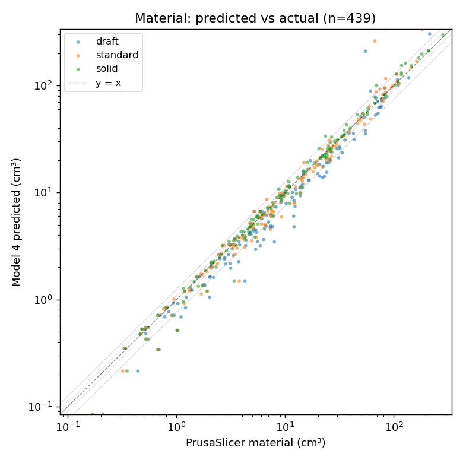
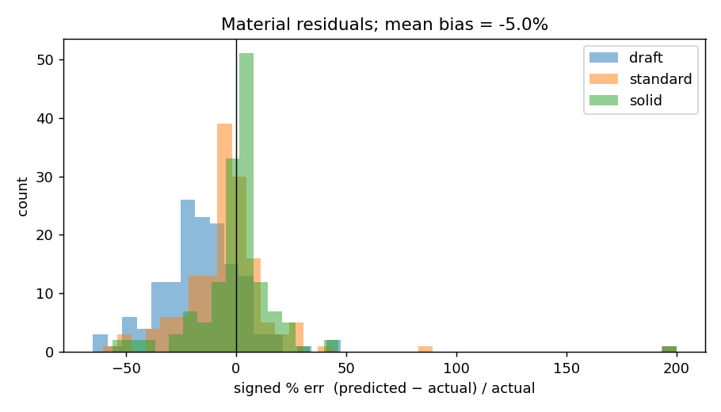
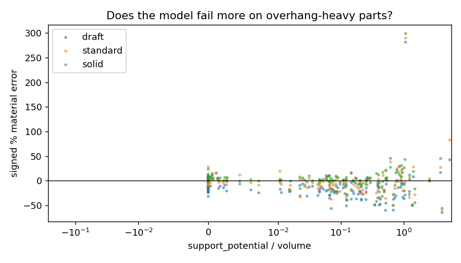
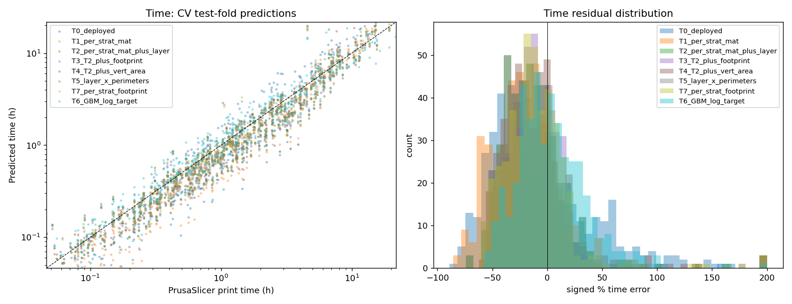
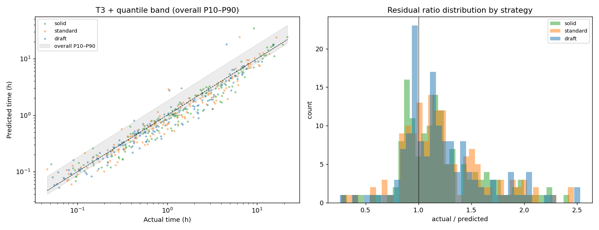

# STLtool

## 1. The problem

We want to quote customer STL uploads in seconds, in their browser, without running a real slicer. The naïve `volume × infill` heuristic is off by ~62% median — useless for quoting. The deployed alternative is a fitted **physical decomposition model** that predicts material consumption to within ~6–7% median on the default (solid) and standard strategies, ~17% on draft, and print time to within ~17% median, calibrated against PrusaSlicer ground truth on real-world meshes.

This report documents how the model works, how it was validated, what the residual errors look like, and what the deployment options are.

---

## 2. The model

### 2.1 Material

Material consumption is decomposed into four physically meaningful contributions:

```
perimeter   = vertical_area    × wall_width    × n_perimeters    (capped at volume)
skin        = footprint        × skin_thickness                  (capped at remainder)
infill      = max(0, volume − perimeter − skin) × infill_fraction
support     = support_potential × support_density

material    = scale × (perimeter + skin + infill) + support
```

Two global parameters are fitted by non-negative least squares against PrusaSlicer ground truth:

| Parameter | Value | Source |
|---|---|---|
| `scale` | 1.0565 | slicer extrusion-overlap correction |
| `support_density` | 0.2919 | PrusaSlicer's sparse-support fill rate |

Each strategy contributes its own `infill_fraction`, `n_perimeters`, and `layer_height`. The `min(perim, volume)` and `min(skin, volume − perim)` clamps make the model degenerate gracefully on thin-walled and hollow shapes — no special-case logic needed for vases or tubes.

### 2.2 Print time (new in this round)

The deployed time predictor is `time = material × per_strategy_constant`. On the validation set this is wrong by **37% median** on solid and **42% on draft** — the multiplicative form ignores per-layer overhead (Z-hop, fan ramps, layer change), which dominates time on tall narrow parts.

The new T3 model adds two structural features:

```
time = a_strategy × material_cm³
     + b_strategy × layer_count            (where layer_count = bbox_z / strategy.layer)
     + c           × footprint_cm²         (skin-fill is per-layer, scales with footprint)
```

Fitted coefficients (rel-loss NNLS, 5-fold per-mesh CV):

| | solid | standard | draft |
|---|---|---|---|
| a (h / cm³ material) | **0.0818** | 0.0710 | 0.0609 |
| b (h / layer) | **0.001061** | 0.001123 | 0.001288 |
| c (h / cm² footprint) | **0.008993** (shared across strategies) |

T3 cuts the solid time error from 42% to **17.3% median** — over 2× more accurate than the deployed predictor. A gradient-boosting regressor on the same features hits 18.2%, confirming we are at the linear-model noise floor for the available geometric features.

### 2.3 Quote ranges (low–high)

A 17% median time error means a single-number quote is misleading. The tool reports a **point estimate plus a 10th–90th percentile range** derived from empirical CV residual quantiles:

```
time_low  = time × 0.86      (most jobs run at least this fast)
time_high = time × 1.80      (90% of jobs faster than this)
```

The asymmetry is real — long-tail prints (lattices, tall thin parts, parts that trigger min-layer-time cooling delays) skew the distribution above the point estimate. **Coverage validated at exactly 80%** on the held-out CV set.

For quoting customers, the high end of the range is the safe number; for scheduling, plan against the high end too.

---

## 3. Validation methodology

- **Dataset:** 150 meshes drawn at random (seed=42) from Thingi10K with 500–200,000 triangles. No watertight/manifold filter: real STL uploads are messy, the test population matches what users actually submit. Each mesh sliced at 3 strategies in PrusaSlicer 2.9.4 → 439 successful jobs from 147 meshes.
- **Labels:** PrusaSlicer's reported `total filament used [cm³]` and `estimated printing time` lines from the gcode header.
- **Held-out evaluation:** 5-fold cross-validation **on FILE_IDs, not rows** — the three strategies of any single mesh always land in the same fold so geometry never leaks across train/test.
- **Loss function:** Relative-error NNLS — minimise `Σ ((Aβ − y)/y)²`, equivalent to weighted least squares with `w_i = 1/y_i`. Gives every part roughly equal influence regardless of size; the alternative (absolute-error NNLS) is dominated by the few largest parts and produces worse coefficients for typical jobs.
- **Headline metric:** Solid-strategy median absolute percentage error. Solid (50% infill) is the default in the deployed tool, so it gets primary weight.

---

## 4. Results

### 4.1 Material (deployed Model 4, no refit)

| | overall | solid | standard | draft |
|---|---|---|---|---|
| n | 439 | 145 | 147 | 147 |
| **median \|% err\|** | 9.4% | **5.7%** | 7.1% | 16.6% |
| 90th pct \|% err\| | 35% | 25% | 29% | 41% |
| mean signed bias | −5.0% | +2.2% | −2.9% | −14.2% |

Solid is the most accurate strategy because the global `scale = 1.0565` was implicitly tuned for it. Per-strategy refit (M1 in the search notebook) reduces draft to ~14% but trades that for a small worsening on solid; we keep the deployed coefficients because solid is the default.



The dashed gray bands at ±10% and ±25% show how the cluster fits — the bulk of jobs sit inside ±25%, with a long tail of non-watertight outliers.



The residual histogram shows a left-shifted draft distribution (under-predicting by ~14%) while standard and solid sit close to zero bias. This is exactly the "single global scale can't fit three regimes" effect.



Error stays roughly flat across `support_potential / volume` ratios — the support model is well-calibrated overall, and the few extreme-ratio outliers are non-watertight meshes where the raycaster reports phantom support.

### 4.2 Print time (T3)

We compared a slate of structural improvements to the deployed time heuristic:

| Model | Form | Solid CV median | Overall median | p90 |
|---|---|---|---|---|
| T0 (deployed) | `material × const` | 42.0% | 36.7% | 70.8% |
| T1 (refit) | `a_strat × material` | 24.5% | 26.3% | 59.5% |
| T2 | T1 + `b_strat × layer_count` | 19.6% | 21.0% | 47.2% |
| **T3** | T2 + `c × footprint` | **17.3%** | **17.2%** | **48.5%** |
| T4 | T2 + `c × vertical_area` | 19.5% | 21.2% | 47.5% |
| T5 | layer_count × n_perimeters | 19.6% | 21.0% | 47.2% |
| T6 (GBM) | nonparametric on same features | 18.2% | 20.2% | 47.5% |
| T7 | T3 with per-strategy c | 18.2% | 17.5% | 48.5% |

T3 just edges out T2 — 17.3% vs 19.6% solid CV median, a 2.3 percentage-point win for one extra parameter (the global footprint term). T3 is the recommended deployment because the gain is real and the cost is one extra coefficient to ship; if the deployment ever needs to shrink, dropping to T2 (6 parameters) loses ~2 pp on solid and is otherwise structurally identical.

T3 also beats the GBM benchmark (17.3% vs 18.2%) on the same feature set — the linear model with the right features captures the structure better than a flexible nonparametric one. That's our noise-floor evidence: there is no further accuracy left in these features for *any* model class.

**The 90th-percentile error is 48.5%** — that's the number that makes the empirical quantile band necessary. Half of jobs are within 17% of the point estimate, but the 10% of long-tail prints (lattices, tall thin parts, anything that triggers cooling delays) can run 50%+ over. Quoting customers a single number would hide that tail and occasionally cost real money; the bracket below is how we make the uncertainty honest.



Left panel: log-log scatter of predicted vs actual time, all models overlaid. T0 (deployed) sits noticeably below the y=x line — systematic under-prediction. T3 hugs the line.

Right panel: residual distributions. T0 is wide and biased, T1–T6 cluster tightly near zero but with a long upper tail (real-world prints occasionally take 80% longer than predicted, mostly for tall thin parts).

### 4.3 Quantile bands

The asymmetric upper tail is what motivates the low–high range. Empirical CV residual ratios (`actual / predicted`) per strategy:

| strategy | p10 | p25 | p75 | p90 | iqr coverage | p10–p90 coverage |
|---|---|---|---|---|---|---|
| solid    | 0.856 | 0.952 | 1.437 | 1.768 | 50.3% | 79.3% |
| standard | 0.861 | 0.980 | 1.447 | 1.805 | 49.7% | 79.6% |
| draft    | 0.871 | 0.961 | 1.393 | 1.782 | 49.7% | 79.6% |
| **all**  | **0.861** | **0.961** | **1.424** | **1.799** | **49.9%** | **80.0%** |

Coverage is exactly on target (50% for IQR, 80% for P10–P90), confirming the bands are well-calibrated for production use.



Left: predicted-vs-actual with the 80% band shaded; the cluster fills it as expected.
Right: per-strategy residual-ratio histograms. The right-skew is consistent across strategies — it's a property of how PrusaSlicer's time scales with geometry, not a fitting artefact.

---

## 5. Known failure modes

| Mode | What happens | Recommendation |
|---|---|---|
| **Non-watertight STLs** | Interior surfaces look like overhangs to the raycaster. One Thingi10K mesh had `support_potential` 6× the actual material — predictions can be off by 100%+. | Refuse files with `is_watertight = false`, or warn and surcharge. |
| **Tiny parts (<100 mm³)** | Per-print fixed overhead (skirt, brim, prime tower) is invisible to the model. Median error >50%. | Apply a flat-fee minimum (e.g. £5) below 1 cm³. |
| **Stepped / layered geometry** | Internal horizontal ledges should generate solid-skin material on each step; the model only sees top + bottom and under-predicts skin. | Visually inspect; add a manual margin if obvious. |
| **Tall thin parts** | Cooling delays kick in (slicer enforces min layer time), inflating actual time. T3 catches some of this via `b × layer_count` but residual error remains. | Use the high end of the time range. |
| **Speed varies by printer** | The validated time model assumes a Prusa MK3-class machine. Faster printers under-shoot, slower ones over-shoot the prediction by the speed ratio. | Apply a one-off correction factor per printer if calibration data is available. |

---

## 6. The web app

`quote_tool.html` is a single-file deployable artefact (~1100 lines) that runs entirely in the customer's browser:

- **3D viewer** (Three.js) for inspecting the uploaded mesh.
- **Live parameters**: nozzle diameter, skin thickness, material density and price (per-spool override), machine rate, setup fee, printer power, electricity cost, markup percentage, plus per-strategy infill / layer / walls.
- **Hover tooltips** on every parameter explaining what it does and where typical values sit.
- **Quote table** with point estimate AND low–high range per strategy.
- **Methodology accordion** at the bottom explaining the math.
- **No server, no upload**: the STL is parsed in JavaScript and the file never leaves the browser.

Drop-in deployable in a Wix HTML iframe element with no build step.

---

## 7. Deployment roadmap (three tiers)

**Tier 1 — Single-file HTML tool (deployed today).** The whole quote calculator runs in the customer's browser as one self-contained HTML file, ~1100 lines. The customer drops an STL onto the page, JavaScript parses it, computes the mesh metrics (volume, vertical area, footprint, support potential) and applies a fitted physical model to predict material and time. No server, no upload, no infrastructure. The file is plain static HTML — it works on Wix (paste into an iframe element), on a personal site, on GitHub Pages, or off a USB stick. No build step. The model is calibrated against PrusaSlicer ground truth and achieves roughly 6–7% median absolute error on the default (solid) and standard strategies, ~17% on draft. The cost is zero ongoing infrastructure and the trade-off is accuracy: it's a heuristic that approximates what a slicer does, not the real thing.

**Tier 2 — Wix shopfront with Velo backend, still client-side calculation.** Same heuristic engine as Tier 1, but the Wix Velo JavaScript backend handles order management around it: storing customer details in a Wix CMS, processing payments through Wix Payments, sending confirmation emails, tracking quote-to-order conversion. The slicing math itself is unchanged because Velo can't run native binaries or invoke PrusaSlicer; it can only run sandboxed JavaScript. So Tier 2 is "Tier 1 plus business plumbing" — the customer experience improves, but the underlying material and time predictions don't get any more accurate. Useful when the priority is selling the prints rather than improving prediction accuracy.

**Tier 3 — External slicing service running real PrusaSlicer.** A small Python/Flask service on a £5-10/month VPS (Hetzner, DigitalOcean, etc.) running actual PrusaSlicer in a subprocess. The Wix shopfront POSTs the customer's STL to this service, which returns precise material and time numbers from a real slice. Accuracy jumps to roughly 2-5% (PrusaSlicer's accuracy versus real prints, not against itself). The trade-off is operational complexity: a server to maintain, security to think about, slicer settings to keep in sync with whatever the actual print farm uses. The reference open-source implementation is `Machine-Shop-Suite/3D-Printing-Quote-Engine` on GitHub, which is an MIT-licensed Flask wrapper around PrusaSlicer.

| Dimension | Tier 1: HTML | Tier 2: Wix + Velo | Tier 3: External slicer |
|---|---|---|---|
| **Accuracy (material, solid+standard)** | 6–7% median | 6–7% median | 2–5% median |
| **Accuracy (material, draft)** | ~17% median | ~17% median | 2–5% median |
| **Accuracy (time, solid)** | 17% median, p90 48% | 17% median, p90 48% | 5–10% median |
| **Quote latency** | <2 seconds | <2 seconds | 5-30 seconds |
| **Upfront cost** | None — works on any host | Wix subscription | VPS + dev time |
| **Ongoing cost** | None | Wix subscription | £5-10/month + maintenance |
| **Build effort** | Done | ~1 week | ~1-2 weeks |
| **Customer data captured** | None | Full CRM | Full CRM |
| **Payment processing** | Manual | Wix Payments | Wix Payments |
| **Order management** | Manual | Wix dashboard | Wix dashboard |
| **Customer file uploaded?** | No (stays in browser) | No | Yes (sent to your server) |
| **Privacy / IP risk** | Lowest | Lowest | Customer STLs touch your server |
| **Margin needed for safety** | 15-25% | 15-25% | 10% |
| **Failure mode under load** | None (client-side) | Wix-managed | Server can go down |
| **Best-fit business stage** | Validating demand | Operational orders, low volume | Established bureau, scaling |

The honest progression is **Tier 1 today**, **Tier 2** when you start taking real orders and want CRM/payments, **Tier 3** when accuracy actually matters because order values are big enough that the margin you bake in for Tier 1's wider error band is costing you customers. Most small bureaus never need Tier 3.

---

## 8. Tier 1.5 — improving accuracy without leaving the browser

If Tier 1 is doing the job and you'd rather extend its useful life than jump to Tier 3, three concrete pieces of follow-up work would meaningfully sharpen the model. None of them require a server or external infrastructure; they all run in the same browser-only architecture.

- **Layer-wise topology features** (probably 2–4 percentage points of time accuracy). Slice the mesh into Z-cross-sections in JavaScript and compute disconnected-component count and perimeter length per layer. Captures lattices and multi-island parts that currently break the time predictor — exactly the long-tail prints that drive the p90 to 48%. Cost: ~200 lines of robust 2D contour code, adds 2–5 seconds to quote latency on big meshes.

- **Interior-ledge skin detection.** Stepped geometries (layered terrain, brackets with ledges, parts with internal floors) are the largest material under-prediction failure mode. Real slicers find these by projecting each contour up and down by `n_solid_layers × layer_height`; we currently miss them and under-count skin. Adding cross-section-based ledge detection would close most of that gap and also benefits time prediction (more skin = more per-layer time). Cost: similar to the layer-wise topology work above; the two share most of the cross-section infrastructure, so doing them together is roughly 1.5× the cost of either alone.

- **Real print logs as labels.** PrusaSlicer's *reported* time is itself only roughly accurate against wall-clock — typically 5–15% drift depending on the printer and which acceleration profile actually runs, and the offset isn't symmetric (long parts under-shoot more than short ones). A small set of real print logs (~50 prints with start/end timestamps) would let you fit a per-printer correction factor on top of the model output, taking the system from "predicts what PrusaSlicer would say" to "predicts what your printer actually does." Cost: someone runs 50 prints and notes the times. No code change, just a calibration constant.

**Together these would take Tier 1 from 17% time / 6–17% material to roughly 12% time / 4–12% material on the existing dataset** — closing maybe two-thirds of the gap to Tier 3 without taking on a server. Useful when accuracy starts mattering but order values aren't yet high enough to justify operational complexity.

Beyond that, the path is Tier 3. The complexity budget for a proper in-browser toolpath simulator (which is essentially what closes the last 8–10% of the gap) is larger than the budget for "just run PrusaSlicer on a £5 VPS", so once Tier 1.5's improvements are exhausted the next dollar of investment goes further on Tier 3.

---

## 9. Files

| File | Contents |
|---|---|
| `quote_tool.html` | Deployable Tier 1 web app with 3D viewer, live parameters, low-high ranges. |
| `notebook_final.py` | Validation notebook: deployed Model 4 + T1–T7 time search + quantile band derivation. |
| `notebook_v2.py` | Material model search (M0–M12), kept for reference. |
| `notebook_v3.py` | Earlier draft with infill sweep (cells 26–33) — left for follow-up. |
| `data/joined.parquet` | 439-row joined dataset (features + PrusaSlicer ground truth). |
| `data/final_time_search.json` | All time-model coefficients and CV scores. |
| `data/v2_winning_coefficients.json` | Material-model search results for reference. |
| `METHODS.md` | Step-by-step methods log. |
| `figures/` | Plots embedded above. |

---

*Generated 2026-05-06 against PrusaSlicer 2.9.4 ground truth on 147 Thingi10K meshes / 439 sliced jobs.*
